<div align="center">

<a href="https://github.com/aminio9">
  
</a>

<br />

[](https://github.com/aminio9)
[](https://github.com/aminio9?tab=followers)
[](https://www.linkedin.com/in/aminio9)
[](mailto:amininmohammadhasan7@gmail.com)

</div>

## `$ whoami`

```yaml
name: Mohammadhassan Amini
role: DevOps Engineer · Site Reliability Engineer · Python & Go Developer
location: Tehran, Iran
mission: Build reliable delivery systems that turn commits into observable production workloads
currently:
  - Engineering CI/CD pipelines and container platforms
  - Building backend and automation tooling with Python, Go, and Bash
  - Researching federated learning and blockchain security
education:
  - M.S. Computer Engineering (Software Engineering) · Iran University of Science and Technology
  - B.S. Computer Engineering (Software Engineering) · University of Isfahan
```

I work where **software engineering meets infrastructure**: packaging services, automating delivery, operating container platforms, and making systems measurable. I care about reproducible builds, declarative infrastructure, useful observability, and boring deployments.

## `$ kubectl get skills -o wide`

<div align="center">

| Runtime & Code | Platform & Delivery | Reliability & Traffic |
|:---:|:---:|:---:|
| Python · Go · Bash | Linux · Git · GitLab CI/CD | Prometheus · Grafana · Loki |
| FastAPI · REST APIs | Docker · Compose · Swarm | Traefik · Nginx · Alerting |
| Automation · CLI tooling | Kubernetes · Ansible | Reverse proxy · Load balancing |

</div>

<div align="center">


</div>

## `$ ls -la ./featured-projects`

### [Production-Grade DevOps Platform](https://hamgit.ir/mhaminii18/task-manager) `2026`

> An end-to-end delivery platform for a FastAPI + React task manager, from commit to observable Kubernetes workloads.

- Built a **10-job GitLab CI/CD pipeline** across lint, test, build, push, and deploy stages.
- Packaged frontend and backend with Alpine-based multi-stage Docker builds.
- Defined Kubernetes Deployments, StatefulSets, Services, ConfigMaps, Secrets, HPAs, and Traefik Ingress.
- Automated kubeadm cluster provisioning with Ansible roles for containerd, Calico CNI, workers, and Nexus integration.
- Added Prometheus metrics and Grafana dashboards for operational visibility.

### [ShopStream](https://github.com/aminio9/shopstream) `Docker Swarm · Microservices`

> A production-style e-commerce learning platform with six application services and a complete supporting data and observability stack.

- Orchestrates **15+ services** with Docker Swarm, overlay networks, secrets, configs, and persistent volumes.
- Routes APIs, the frontend, and WebSockets through Traefik with rate limiting and health checks.
- Runs MariaDB, Redis, RabbitMQ, Elasticsearch, MinIO, Prometheus, Grafana, Loki, and Alertmanager.
- Includes scripts for cluster setup, image builds, deployment, health checks, smoke tests, backups, and secrets.

### [Access Log Analyzer](https://github.com/aminio9/accesslog-cli) `Python · CLI`

> A streaming log-analysis CLI designed to process large web access logs without loading the entire file into memory.

- Reports request volume, unique IPs, top endpoints, status codes, error rate, and traffic hotspots.
- Uses hash maps and sets for efficient aggregation and regex-based parsing for structured access logs.
- Demonstrated against **500,000 requests** with terminal-native tables and histograms.

<div align="center">

[](https://github.com/aminio9/shopstream)
[](https://github.com/aminio9/accesslog-cli)

</div>

## `$ ./observe --engineer aminio9`

<div align="center">

<picture>
  <source media="(prefers-color-scheme: dark)" srcset="https://github-readme-stats.vercel.app/api?username=aminio9&show_icons=true&include_all_commits=true&hide_border=true&bg_color=00000000&title_color=22d3ee&icon_color=22c55e&text_color=94a3b8&ring_color=22d3ee" />
  
</picture>
<picture>
  <source media="(prefers-color-scheme: dark)" srcset="https://streak-stats.demolab.com?user=aminio9&hide_border=true&background=00000000&ring=22D3EE&fire=22C55E&currStreakLabel=22D3EE&sideLabels=94A3B8&dates=64748B&currStreakNum=E2E8F0&sideNums=E2E8F0" />
  
</picture>

<picture>
  <source media="(prefers-color-scheme: dark)" srcset="https://github-readme-activity-graph.vercel.app/graph?username=aminio9&bg_color=00000000&color=94a3b8&line=22d3ee&point=22c55e&area=true&hide_border=true" />
  
</picture>

### Contribution stream

<picture>
  <source media="(prefers-color-scheme: dark)" srcset="https://raw.githubusercontent.com/aminio9/aminio9/output/github-contribution-grid-snake-dark.svg" />
  <source media="(prefers-color-scheme: light)" srcset="https://raw.githubusercontent.com/aminio9/aminio9/output/github-contribution-grid-snake.svg" />
  
</picture>

</div>

## `$ cat contact.env`

```bash
GITHUB="https://github.com/aminio9"
LINKEDIN="https://www.linkedin.com/in/aminio9"
EMAIL="amininmohammadhasan7@gmail.com"
STATUS="open to DevOps, SRE, Python, and Go opportunities"
```

<div align="center">

**Build it. Automate it. Observe it. Improve it.**

<sub>Linux-powered · infrastructure-minded · always learning</sub>

</div>
